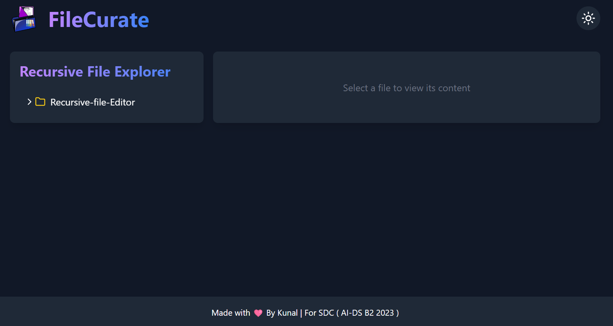

## 📂 **FileCurate** - Intuitive and Interactive File Navigation Interface

### 🌟 **Overview**
**FileCurate** offers a sleek, user-friendly file navigation experience, styled like GitHub’s sidebar. Designed for intuitive navigation and optimized for responsiveness, it provides a streamlined way to view, expand, and interact with files and folders. Featuring smooth animations and an easy-to-use editor, FileCurate ensures a seamless experience for users across all devices.

<div align="center">
  
</div>

---

### ✨ **Features**

- **GitHub-style Sidebar Navigation**: An expandable and collapsible sidebar for folder navigation, providing a clear view of files and their nested structures.
- **Interactive Editor View**: Clicking on a file opens it side-by-side within the editor, displaying its content for easy access and editing.
- **Responsive Design**: The interface adapts well to different screen sizes, delivering a consistent experience across devices.
- **Customizable Themes**: Users can toggle between themes for a personalized look and feel.
- **Smooth Transitions**: Each folder expansion and transition is enhanced with smooth animations powered by Framer Motion for an enjoyable browsing experience.

---

### 🛠 **Tech Stack**

- **Frontend**: 
  - **ReactJS** + **TypeScript**: Providing a robust foundation for building the interface.
  - **JavaScript**: Enhancing interactivity and responsiveness.
  - **Three.js**: For potential 3D visualizations within the UI.
  - **Framer Motion**: Adds smooth, engaging animations for folder expansion and transitions.

---

### 🚀 **Getting Started**

1. **Clone the Repository**: 
   ```bash
   git clone https://github.com/username/FileCurate.git
   ```

2. **Install Dependencies**: 
   ```bash
   npm install
   ```

3. **Run the Application**:
   ```bash
   npm start
   ```

4. **Navigate**: Explore the clean and interactive file navigation sidebar!

---

### 🎯 **Benefits**

- **Effortless File Navigation**: Simplifies navigation within complex folder structures.
- **Enhanced Accessibility**: Smooth transitions and clean layout enhance usability, even with extensive nested folders.
- **Optimized for Productivity**: Side-by-side file views within an editor facilitate easy review and edits.

---

### ⚙️ **How It Works**

1. **Navigation Sidebar**: Expands to reveal files and folders in a GitHub-style layout.
2. **Editor**: When a file is selected, it opens side-by-side in the editor for easy access.
3. **Responsive and Themed UI**: Toggle themes to suit your preferences, and enjoy a consistent experience across screen sizes.

---

### 🤝 **Contributing**

We welcome contributions to enhance FileCurate! To contribute:
1. Fork the repository
2. Create a new branch for your feature or bug fix
3. Submit a pull request for review

---

### 📬 **Feedback and Support**

For suggestions, feature requests, or to report a bug, please open an issue in the GitHub repository.

---

> **Explore, Navigate, and Curate Your Files with Ease with FileCurate!**
